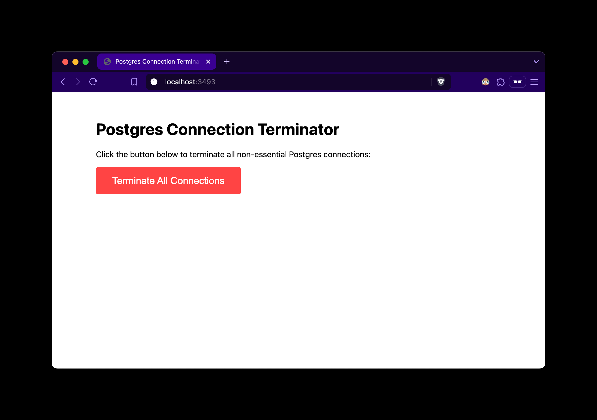

# Postgres Connection Terminator 🔌✂️

A web service that maintains a dedicated connection to your Postgres database for emergency connection termination. Perfect for those moments when you hit connection limits and can't even connect to fix the problem.



## The Problem

A lot of Postgres firefighting situations are related to connection limits. When debugging or making changes, you might want to "terminate all connections", but find yourself unable to do so.

## Usage

Set the `POSTGRES_URL` and `SECRET_KEY` environment variables in a `.env` file:

```bash
POSTGRES_URL=
SECRET_KEY=
```

Run the server:

```bash
bun run index.ts
```
